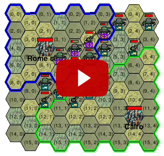

# RL based controller for strategic game agent
The objective of this project is to develop a Reinforcement Learning agent for a simulator that replicates the combat system of the Civilization game, utilizing the DQN algorithm.

## How to launch
Follow the instructions to run the project:

- Clone and install the requirements:
```
git clone https://github.com/tikhonovpavel/civ_vi_ai.git
cd civ_vi_ai
pip install -r requirements.txt
```

- Run the training script:
```
python3 start_training.py --silent --n_games 2000 --episode_max_length 10 --replay_buffer_size 500
```

(If you want to visualize the process, remove `--silent` argument)

## Results




## Method Explanation


The `start_training()` method in the `TrainingSession` class performs the primary loop. It initiates by invoking the `create_paths()` method, first for the `QLearningAI`, and then for the `SimpleAI`.


The `create_paths()` method manages the movement of a player's units. It iteratively processes each unit and triggers the `Unit.move()` method, which both executes the unit's movement and computes the associated rewards. All these rewards are then stored in the `ReplayBuffer`.


After the end of each game, the `update_models()` method of `QLearningAI` is executed. It uses the TD learning objective to update the model, using the sample from the replay buffer.